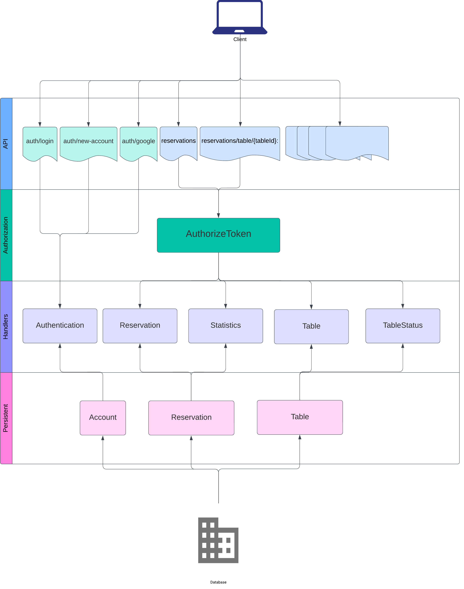

<h3 align="center">restaurant-reservations</h3>

<div align="center">

[]()

</div>

---

<p align="center">Web application for managing restaurant reservations. 
</p>

## 📝 Table of Contents

- [About](#about)
- [Getting Started](#getting_started)
- [Deployment](#deployment)
- [Usage](#usage)
- [Built Using](#built_using)
- [Authors](#authors)

## 🧐 About <a name = "about"></a>

The goal is to develop a web application for managing restaurant reservations. The application should allow customers to view table availability and make reservations. Administrators can manage reservations, change the status of tables (available, reserved, occupied), and view usage statistics. 

## 🏁 Getting Started <a name = "getting_started"></a>

These instructions will get you a copy of the project up and running on your local machine for development and testing purposes. 

### Prerequisites

The first thing we need to do is install docker. If you're running Linux, there's a good chance that your package manager already has docker available (don't confuse it with a KDE package of the same
name!), but for the most up-to-date version, you can download it from https://docker.com. One slight complication is if you're running RedHat Enterprise Linux; Fedora and CentOS are just fine. There's a
special version of docker that works with RHEL, but it doesn't work as easily. At this point, you can ignore the rest of this section.

If you're running MacOS, then there's a download available from https://docker.com called Docker Desktop. It installs and runs easily. At this point, you can ignore the rest of this section.

If you're running Windows, life becomes more complicated.  We're going to restrict ourselves to Docker Desktop under Windows 10. The next thing you need to do is ensure you're running at least version 2004, which supports Windows Subsystem for Linux version 2 (WSL 2).

- Go to https://aka.ms/wslstore and get a WSL Linux distribution. Ubuntu is a good choice.
- Install https://wslstorestorage.blob.core.windows.net/wslblob/wsl_update_x64.msi
- In an Admin PowerShell, run the following:
  - <code>dism.exe /online /enable-feature /featurename:VirtualMachinePlatform /all /norestart</code>
  - You might need to restart at this point.
  - <code>wsl --set-default-version 2</code>
  - <code>wsl --set-version Ubuntu 2</code>
-  There's a docker service icon at the bottom right (it's a whale) -- right-click on it and select "Settings:
    -  Enable WSL 2 as the engine, instead of Hyper-V. This allows docker to take advantage of the Windows/Linux integration in the OS.
    -  Expose the TCP daemon on localhost without TLS.
-  For convenience, I suggest doing the following in the Ubuntu shell:
    -  <code>ln -s "/mnt/c/Users/<your username>" winhome</code>
    -  That will allow you to access your Windows home directory from Ubuntu as <code>~/winhome/</code>

You should now be able to run all docker commands from either PowerShell or
the WSL Ubuntu (or other distribution) shell.


### Installing

In the root folder, run Docker Compose for DEV:

```
docker compose -f compose.dev.yml up -d
```

## 🔧 Break down into end to end tests

In the root folder, run Docker Compose for E2E:

```
docker compose -f compose.e2e.yml up -d
```

## 🎈 Usage <a name="usage"></a>

Add notes about how to use the system.

## ⛏️ API Architecture <a name = "architecture"></a>


## ⛏️ Built Using <a name = "built_using"></a>


- [ExpressJS](https://expressjs.com/) - Server Framework
- [Typescript](https://www.typescriptlang.org/) - Programming language
- [TypeORM](https://typeorm.io/) - ORM
- [NodeJs](https://nodejs.org/en/) - Server Environment
- [MariaDB](https://mariadb.com/) - Database
- [JWT](https://jwt.io/) - JSON Web Tokens
- [Winston](https://github.com/winstonjs/winston) - Logger
- [Angular v14](https://v14.angular.io/docs) - Frontend Framework
- [NgRx](https://ngrx.io/) - Reactive State 
- [RxJs](https://rxjs.dev/) - Reactive Programming
- [NG-Bootstrap](https://ng-bootstrap.github.io/#/home) - Frontend Toolkit
- [NGX-Echarts](https://xieziyu.github.io/ngx-echarts/#/welcome) - Charts
- [Socket.io](https://socket.io/) - Communication


## ✍️ Authors <a name = "authors"></a>

- [@alanortega-uno](https://github.com/alanortega-uno)
